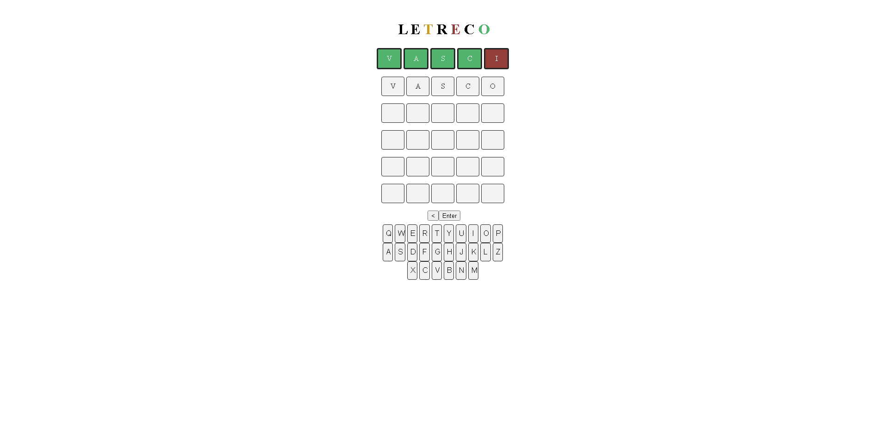

# 🧩 Letreco

## 📖 Descrição

O **Letreco** é uma versão simplificada do jogo Wordle, desenvolvida como estudo para reforçar conceitos de **JavaScript puro**, **manipulação de DOM** e **CSS responsivo**.

A ideia é praticar lógica de programação e interação com o usuário sem depender de bibliotecas ou frameworks.

---

## 🎮 Preview  



👉 [Jogar agora na Vercel](https://projeto-dc-letreco.vercel.app/)

[](https://projeto-dc-letreco.vercel.app/)

---

## ⚡ Funcionalidades

- Validação das palavras digitadas.
- Feedback visual (cores diferentes para letras certas, erradas e fora de posição).
- Controle de tentativas por rodada.
- Reinício da partida após acerto ou término.
- Interface simples e responsiva.

---

## 📚 Conceitos praticados

- Loops e manipulação de arrays.
- Funções puras e reutilizáveis.
- Eventos de teclado e clique.
- Manipulação de DOM com `querySelector` e `addEventListener`.
- Estilização dinâmica com CSS.

---

## 🛠️ Tecnologias

- **JavaScript** (puro)
- **HTML5**
- **CSS3**

---

## 🚀 Como usar

1. Clone o repositório:

	```bash
	git clone https://github.com/Matheus-TecDev/Projeto-DC-Letreco.git

    
2. Acesse a pasta do projeto:
    
    ```bash
    cd letreco

    
3. Abra o arquivo `index.html` no navegador
    
    ```bash
    *(ou utilize a extensão **Live Server** do VS Code para melhor experiência).*
    

---

## 🤝 Contribuição

Sugestões de melhorias são **muito bem-vindas**!

- Abra uma **issue** para relatar bugs ou propor ideias.
- Envie um **Pull Request** com suas contribuições.

---

## 📌 Roadmap (versões futuras)

- Adicionar dicionário maior de palavras.
- Implementar ranking de tentativas.
- Melhorar suporte para dispositivos móveis.
- Adicionar modo “dark theme”.

---

## 👨‍💻 Autores

- [Matheus Freire](https://github.com/Matheus-TecDev)  
- [LinkedIn](https://www.linkedin.com/in/matheus-freire-martins-da-costa-318622376/)  

📫 Contato: [matheus.tecnodev@gmail.com](mailto:matheus.tecnodev@gmail.com)
